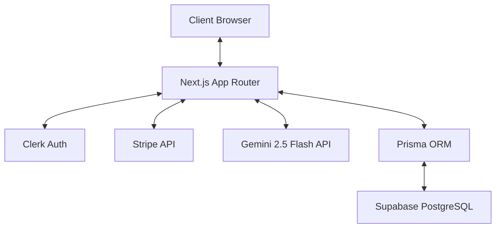

# Formify.ai - Technical Interview & Architecture Guide

Welcome to the technical guide for **Formify.ai** (AI-Driven SaaS Form Generator). This document explains the system architecture, database schema, server actions, page layouts, and the exact code logic. Use this to prepare for code walk-throughs, design reviews, or system architecture interviews.

---

## 🏗️ 1. Architecture & Technology Stack

Formify.ai is built as a modern, full-stack Next.js web application utilizing a serverless, database-backed architecture.



*   **Framework**: **Next.js 15 (App Router)**. Uses Server Components for page rendering and Server Actions (`"use server"`) for mutations, reducing the need for client-side fetch API routes.
*   **Database**: **PostgreSQL** hosted on **Supabase**. Configured with dual connection endpoints:
    *   `DATABASE_URL` (Port 6543): Transaction-mode pooler with `?pgbouncer=true` to handle high concurrent client queries efficiently.
    *   `DIRECT_URL` (Port 5432): Session-mode pooler allowing prepared statements for schema migrations and DB sync operations.
*   **ORM**: **Prisma ORM** for schema declaration, type-safe queries, and schema migration tracking.
*   **Authentication**: **Clerk Auth**. Middleware checks session state globally and redirects anonymous users to sign-in screens.
*   **Payments**: **Stripe Payment Gateway**. Handles checkout redirect links and handles asynchronous webhooks for user subscription state persistence.
*   **AI Engine**: **Gemini 2.5 Flash** (via `@google/generative-ai`). Handles structural form schema generation, response tag classification, and executive summary analyses.

---

## 🗄️ 2. Data Model (Prisma Schema)

The database consists of three core tables defined in [schema.prisma](file:///r:/Videos/Movavi/Video/Editor/Projects/FormGenerator/prisma/schema.prisma):

### 1. `Form`
Stores AI-generated form structures and summary analytics.
*   `id`: Primary key (Autoincrementing Int).
*   `ownerId`: Clerk User ID string mapping form ownership.
*   `createdAt`: Timestamp of form creation.
*   `published`: Boolean state tracking if the form is live for public responses.
*   `content`: **JSON field** containing the form schema: title, button label, and field inputs (names, labels, option arrays, type selectors).
*   `submissions`: Int counter tracking response count.
*   `shareUrl`: Unique UUID string for public sharing links.
*   `aiSummary`: Caches Markdown summaries generated by Gemini to prevent redundant AI API calls.

### 2. `Submissions`
Stores form responses submitted by public users.
*   `id`: Primary key (Autoincrementing Int).
*   `createdAt`: Timestamp of submission.
*   `formId`: Foreign key relating back to the `Form` model.
*   `content`: **JSON field** containing response data mapping `{ "field_name": "user_input" }`.
*   `tags`: String array containing AI-generated categorization labels (e.g., `["Urgent", "Billing"]`).

### 3. `Subscription`
Tracks the Stripe payment status of registered users.
*   `userId`: Clerk User ID matching the subscriber.
*   `subscribed`: Boolean flag checking premium status.

---

## 🖥️ 3. Page-by-Page System Breakdown

### 1. Landing Page (`/`)
*   **Path**: `app/(home)/page.tsx`
*   **Purpose**: Public entrance, value proposition, pricing tiers, and quick-start prompt suggestions.
*   **Logic**:
    *   Redirects unauthenticated visitors to `/sign-in` (via Clerk).
    *   Queries `getForms()` and `getUserSubscription()` on the server to determine usage count and upgrade flags.
    *   Passes stats into [HeroSection.tsx](file:///r:/Videos/Movavi/Video/Editor/Projects/FormGenerator/components/HeroSection.tsx) where users can click presets (Job Application, Course Registration, Feedback) or write a custom description.
    *   Renders [PricingPage.tsx](file:///r:/Videos/Movavi/Video/Editor/Projects/FormGenerator/components/PricingPage.tsx) displaying SaaS packages (Free, Pro, Enterprise) using dynamic checkout links.

### 2. Dashboard Redirect (`/dashboard`)
*   **Path**: `app/dashboard/page.tsx`
*   **Purpose**: Automatic routing layer.
*   **Logic**:
    *   Routes `/dashboard` traffic to `/dashboard/forms` using Next.js `redirect()` to avoid empty 404 routes.

### 3. My Forms List (`/dashboard/forms`)
*   **Path**: `app/dashboard/forms/page.tsx`
*   **Purpose**: Displays the user's generated forms and hosts the "Create New Form" dialog.
*   **Logic**:
    *   Queries the user's total forms count and subscription status.
    *   Renders a grid of cards using [FormList.tsx](file:///r:/Videos/Movavi/Video/Editor/Projects/FormGenerator/components/FormList.tsx) showing submission tallies and providing Edit and Delete buttons.
    *   Implements a shadcn/ui Dialog containing the [GenerateFormInput.tsx](file:///r:/Videos/Movavi/Video/Editor/Projects/FormGenerator/components/GenerateFormInput.tsx) component.
    *   **Usage Enforcing**: If the user is on the Free tier and has already reached their maximum count (`3` forms), the "Generate Form" button is replaced with a locked "Upgrade Plan" CTA.

### 4. Form Editor & Preview (`/dashboard/forms/edit/[formId]`)
*   **Path**: `app/dashboard/forms/edit/[formId]/page.tsx`
*   **Purpose**: Preview the AI-generated form and publish it.
*   **Logic**:
    *   Retrieves the form JSON by ID and feeds it to [AiGeneratedForm.tsx](file:///r:/Videos/Movavi/Video/Editor/Projects/FormGenerator/components/AiGeneratedForm.tsx) in `isEditMode = true`.
    *   When the user clicks the "Publish" button, it triggers the `publishForm` server action, marking the record `published: true` in the DB.
    *   Opens a success dialog [FormPublishDialog.tsx](file:///r:/Videos/Movavi/Video/Editor/Projects/FormGenerator/components/FormPublishDialog.tsx) offering a copyable live sharing link: `${origin}/forms/${formId}`.

### 5. Public Live Form (`/forms/[formId]`)
*   **Path**: `app/forms/[formId]/page.tsx`
*   **Purpose**: The actual public form seen by end responders.
*   **Logic**:
    *   **Isolated Layout**: Its layout file ([layout.tsx](file:///r:/Videos/Movavi/Video/Editor/Projects/FormGenerator/app/forms/[formId]/layout.tsx)) does NOT render the dashboard sidebar, securing page isolation and giving form-fillers a clean interface.
    *   Loads form details and maps them to `<AiGeneratedForm isEditMode={false} />`.
    *   Loops through fields dynamically. Form elements (text, textareas, selects, checkboxes, radios) render based on field type properties from the database JSON object.
    *   Submitting the form triggers the `submitForm` server action.

### 6. Responses Dashboard (`/dashboard/forms/[formId]/submissions`)
*   **Path**: `app/dashboard/forms/[formId]/submissions/page.tsx`
*   **Purpose**: Displays all response data, tags, and summary analyses.
*   **Logic**:
    *   Displays the [AiSummaryReport.tsx](file:///r:/Videos/Movavi/Video/Editor/Projects/FormGenerator/components/AiSummaryReport.tsx) module at the top.
    *   Displays a list of responses via [SubmissionDetails.tsx](file:///r:/Videos/Movavi/Video/Editor/Projects/FormGenerator/components/SubmissionDetails.tsx).
    *   **Badge Display**: Displays AI-classified tags for each submission (e.g., Red badge for `Urgent`, Green badge for `Lead`, Amber badge for `Billing`).

### 7. Upgraded Analytics Dashboard (`/dashboard/analytics`)
*   **Path**: `app/dashboard/analytics/page.tsx`
*   **Purpose**: Full workspace overview and AI-driven insights.
*   **Logic**:
    *   Fetches all user forms and submissions.
    *   **In-Memory Aggregations**: Accumulates forms, total responses, urgent counts, and tags to display:
        *   **Metrics Grid**: 4 summary cards (Total Forms, Live Published, Total Responses, Urgent Issues count).
        *   **AI Tag Frequency Bars**: Standardized, responsive horizontal progress bars matching the category tag styles (e.g., green progress bar for `Lead` percentage, rose progress bar for `Urgent` percentage).
        *   **Recent Responses Timeline**: Lists the 5 most recent submissions across all forms with dates, times, and classified AI badges.
        *   **Forms Performance Table**: Displaying a list of forms, statuses, and response counts.

---

## ⚙️ 4. Core Backend Code Logic (Server Actions)

### 1. Form Generation Engine (`generateForm.ts`)
Creates structured form JSON schemas from natural language prompt descriptions.

```typescript
const prompt = "Create a JSON form with the following fields: title, fields (If any field includes options, keep them inside an array, not an object), button.";
const aiResponse = await model.generateContent({
  contents: [{ role: "user", parts: [{ text: `${prompt} ${description}` }] }],
});
let formContent = aiResponse.response.text();

// Extract clean JSON text between brackets to handle markdown formatting
formContent = formContent.substring(formContent.indexOf("{"), formContent.lastIndexOf("}") + 1);
const formJsonData = JSON.parse(formContent);

// Save form record to PostgreSQL
const form = await prisma.form.create({
  data: { ownerId: user.id, content: formJsonData },
});
```

### 2. Async Auto-Tagging Engine (`tagSubmission.ts` & `submitForm.ts`)
Classifies user answers into structured categories. To prevent blocking client-side submission speeds, this runs as a background promise inside `submitForm.ts`.

```typescript
// inside actions/submitForm.ts
const submission = await prisma.submissions.create({
  data: { formId, content: formData },
});

// Non-blocking trigger of AI tagging
tagSubmission(submission.id).catch((err) =>
  console.error("Background tagging error:", err)
);
```

Inside [tagSubmission.ts](file:///r:/Videos/Movavi/Video/Editor/Projects/FormGenerator/actions/tagSubmission.ts):
```typescript
const prompt = `
Analyze the user's answers and select 1 to 3 highly relevant tags from the following list:
- "Urgent" (reports critical errors, expresses frustration, or asks for immediate support)
- "Lead" (interested in registering, purchasing, or scheduling a demo)
- "Billing" (mentions payments, pricing, invoices)
- "Feedback" (suggestions, opinions, comments)
- "Question" (general information inquiries)
- "Spam" (promotional links, advertising, bot submissions)

Return ONLY a valid JSON array of strings containing the selected tags, e.g., ["Urgent", "Billing"].
`;
// Call Gemini, clean output, parse JSON, and save array into Submissions.tags
```

### 3. Executive Report Generator (`generateSummary.ts`)
Takes all text answers collected across responses and feeds them into Gemini to compile a comprehensive markdown overview.

```typescript
// Format responses into structured text context:
const formattedSubmissions = submissions.map((sub, idx) => {
  return `--- Submission #${idx + 1} ---\n` + Object.entries(sub.content)...
}).join("\n\n");

const prompt = `Analyze these submissions and output a clean Markdown report containing:
1. Executive Summary
2. Sentiment Analysis (Positive, Neutral, Negative, or Mixed)
3. Key Takeaways & Trends
4. Actionable Recommendations`;

// Invokes model.generateContent(), and caches the result under Form.aiSummary
```

---

## 💡 5. Crucial SaaS Concepts to Know for Interviews

*   **Optimistic UI / Server Actions**: Next.js Server Actions execute code directly on the server without API endpoints (`/api/route`). Combined with cache revalidation (`revalidatePath`), they sync UI data instantly.
*   **Database Pooling (pgbouncer vs. Session)**: In serverless hosting (Vercel, AWS Lambda), cold starts spin up many short-lived instances. Connecting each directly to PostgreSQL exhausts connection limits. We configure a **Pooler** in transaction mode (`DATABASE_URL` with port 6543) so connections are shared. However, transaction-mode poolers don't support prepared statements (which Prisma uses to compile SQL). To execute migrations, we configure a `DIRECT_URL` (session pooler on port 5432) which routes to single sessions.
*   **JSON-Schema Driven Rendering**: Instead of writing separate database tables for form inputs, the AI creates a flexible JSON schema. The React frontend reads this schema on-the-fly to render specialized inputs (such as parsing `item.type === "select"` to display `<Select>` elements with dynamic children). This makes the form generation process database-agnostic and scalable.
